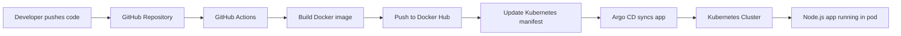

# ArgoCD Node Application

A simple Node.js web application that demonstrates a GitOps workflow using Docker, GitHub Actions, Kubernetes, and Argo CD. The project builds a container image from the app code, pushes it to Docker Hub, updates the Kubernetes deployment manifest, and syncs the application with Argo CD.

## Overview

This repository is a practical example of a GitOps pipeline for a Node.js app. It includes:

- A lightweight Express.js web app
- A Docker image for containerized deployment
- Kubernetes deployment manifests
- A GitHub Actions workflow for CI/CD
- Argo CD for continuous deployment and GitOps synchronization

The application is intentionally small and easy to understand, making it suitable for learning and demonstration purposes.

## Architecture



## Tech Stack

- Node.js
- Express.js
- Docker
- Kubernetes
- GitHub Actions
- Argo CD
- Helm

## Project Structure

```text
argocd-node-application/
├── .github/
│   └── workflows/
│       └── argo-actions.yaml
├── charts/
│   └── argocd/
│       └── values-argo.yaml
├── manifest/
│   ├── deployment.yaml
│   ├── ingress.yaml
│   └── service.yaml
├── setup-argocd.sh
├── setup-runner.sh
├── Dockerfile
├── index.js
├── package.json
├── package-lock.json
├── .env
├── .gitignore
└── README.md
```

## Application Behavior

The app is a basic Express server that renders an HTML page and listens on port 3000 by default.

Key details:

- Main application file: [index.js](index.js)
- Node package configuration: [package.json](package.json)
- Docker image definition: [Dockerfile](Dockerfile)
- Kubernetes deployment manifest: [manifest/deployment.yaml](manifest/deployment.yaml)
- Service manifest: [manifest/service.yaml](manifest/service.yaml)

## Prerequisites

Before running this project, make sure you have the following installed:

- Node.js 14+ or compatible version
- npm
- Docker
- kubectl
- Helm
- Access to a Kubernetes cluster
- A Docker Hub account
- An Argo CD instance or cluster with Argo CD installed
- A GitHub repository with Actions enabled

## Local Development

### 1. Install dependencies

```bash
npm install
```

### 2. Run the app locally

```bash
npm start
```

The app will start on:

```text
http://localhost:3000
```

### 3. Verify the app

Open the URL in a browser or use curl:

```bash
curl http://localhost:3000
```

You should see the HTML page returned by the Express application.

## Docker Deployment

### Build the Docker image

```bash
docker build -t my-app:local .
```

### Run the container locally

```bash
docker run -p 3000:3000 my-app:local
```

Then access:

```text
http://localhost:3000
```

## Kubernetes Deployment

This project includes Kubernetes manifests under [manifest](manifest).

### Deployment manifest

The deployment config creates a pod with 2 replicas and exposes container port 3000.

```yaml
apiVersion: apps/v1
kind: Deployment
metadata:
  name: node-app-deployment
spec:
  replicas: 2
```

### Service manifest

The service exposes the application internally using NodePort.

```bash
kubectl apply -f manifest/service.yaml
kubectl apply -f manifest/deployment.yaml
```

### Optional ingress

The ingress file is included at [manifest/ingress.yaml](manifest/ingress.yaml), but it is currently empty. You can enable it with an ingress controller such as NGINX and customize it according to your cluster setup.

## Argo CD Setup

The repository contains a helper script, [setup-argocd.sh](setup-argocd.sh), which installs Argo CD using Helm.

### Install Argo CD

```bash
chmod +x setup-argocd.sh
./setup-argocd.sh
```

This script:

- checks for Helm and kubectl
- validates Kubernetes cluster access
- adds the Argo CD Helm repository
- installs Argo CD into the `argocd` namespace
- prints the initial admin password

### Access Argo CD

After installation, port-forward the Argo CD server:

```bash
kubectl port-forward svc/argocd-server -n argocd 8080:443
```

Then open:

```text
https://localhost:8080
```

Log in with:

- Username: `admin`
- Password: retrieved from the secret generated during installation

## ✅ Local Quick Setup Guide

Use the following workflow to run this project locally on Minikube and validate the GitOps pipeline end to end.

### 1. Start a Minikube cluster

```bash
minikube start
minikube status
```

This creates a local Kubernetes cluster for running the application and the GitHub self-hosted runner.

### 2. Create a self-hosted runner using the setup script

```bash
chmod +x setup-runner.sh
./setup-runner.sh
```

When prompted:

- enter your GitHub Personal Access Token
- confirm the repository name or accept the default value

The script installs cert-manager, adds the actions-runner-controller Helm repository, deploys the runner controller, and creates a self-hosted runner for the repository.

### 3. Create the Argo CD server using the setup script

```bash
chmod +x setup-argocd.sh
./setup-argocd.sh
```

This script installs Argo CD into the `argocd` namespace and prints the initial admin credentials.

### 4. Run the Argo CD server using port-forward

```bash
kubectl port-forward svc/argocd-server -n argocd 8080:443
```

Then open:

```text
https://localhost:8080
```

### 5. Fetch the Argo CD username and password

```bash
kubectl -n argocd get secret argocd-initial-admin-secret -o jsonpath="{.data.password}" | base64 -d
```

Use:

- Username: `admin`
- Password: the value printed by the command above

### 6. Connect the GitHub repository in Argo CD

Inside the Argo CD UI:

1. Go to `Settings`
2. Select `Repositories`
3. Click `Connect Repo`
4. Add your GitHub repository URL and authentication details

This allows Argo CD to monitor the repository and deploy the application.

### 7. Create an application in Argo CD

You can either create the app from the UI or using the CLI.

Example CLI pattern:

```bash
argocd app create my-app \
  --repo https://github.com/<your-user>/<your-repo>.git \
  --path . \
  --dest-server https://kubernetes.default.svc \
  --dest-namespace argocd
```

If using the UI, create a new app and point it to the GitHub repository and the target cluster/namespace.

### 8. Make a small change in the app and let the CI/CD run

Edit [index.js](index.js) and change something simple, such as the page title or displayed text.

Then push the changes to the `main` branch. GitHub Actions will:

- build the Docker image
- push it to Docker Hub
- update the deployment manifest
- trigger Argo CD sync

### 9. Start the application using Minikube service

Once the service is created, expose it locally with:

```bash
minikube service my-service -n argocd
```

This opens the service URL in the browser and lets you verify the application is running.

> If your service is created in a different namespace, update the namespace in the command accordingly.

## GitHub Actions CI/CD Flow

The GitHub Actions workflow is defined in [.github/workflows/argo-actions.yaml](.github/workflows/argo-actions.yaml).

### What the workflow does

1. Triggers on pushes to `main` when app-related files change.
2. Checks out the source code.
3. Installs Node.js dependencies.
4. Builds a Docker image from the app.
5. Scans the image with Trivy.
6. Authenticates to Docker Hub.
7. Pushes the Docker image.
8. Installs `kubectl` and the Argo CD CLI on a runner.
9. Logs in to Argo CD.
10. Updates the image tag in [manifest/deployment.yaml](manifest/deployment.yaml).
11. Commits the updated manifest.
12. Triggers `argocd app sync my-app` to sync the new deployment.

### Self-hosted runner setup

This repository includes a setup script for GitHub self-hosted runners.

- Setup script: [setup-runner.sh](setup-runner.sh)

The script automates the installation of the GitHub Actions Runner Controller in Kubernetes and creates a self-hosted runner for the repository. It performs the following tasks:

1. Prompts for a GitHub PAT
2. Installs cert-manager
3. Adds the `actions-runner-controller` Helm repository
4. Installs the runner controller in the `actions-runner-system` namespace
5. Creates a `RunnerDeployment` for your GitHub repository
6. Verifies the runner pod and runner status

### Run the self-hosted runner installer

```bash
chmod +x setup-runner.sh
./setup-runner.sh
```

When prompted, enter your GitHub Personal Access Token and optionally the repository in the format:

```text
owner/repository
```

If you leave it blank, the script will default to:

```text
ashif8984/argocd-node-application
```

## Required GitHub Secrets

Add the following secrets in your GitHub repository settings:

- `REPOSITORY_ACCESS_TOKEN`
- `DOCKERHUB_USERNAME`
- `DOCKERHUB_TOKEN`
- `ARGOCD_USERNAME`
- `ARGOCD_PASSWORD`
- `ARGOCD_SERVER`
- `GIT_EMAIL`
- `GIT_USERNAME`

These values are referenced by the workflow in [.github/workflows/argo-actions.yaml](.github/workflows/argo-actions.yaml).

## GitOps Deployment Model

This project follows a GitOps approach:

- application code lives in the Git repository
- Docker image is built from the code
- the deployment manifest is updated in Git
- Argo CD watches the cluster state and syncs from Git
- Kubernetes runs the application from the desired state

This ensures deployments are versioned, reviewable, and easier to manage at scale.

## Example Workflow

A typical deployment flow looks like this:

1. Developer changes app code in [index.js](index.js).
2. A push to the `main` branch triggers the workflow.
3. GitHub Actions builds a new Docker image with the commit SHA as the tag.
4. The image is pushed to Docker Hub.
5. The workflow modifies the image reference in [manifest/deployment.yaml](manifest/deployment.yaml).
6. Git is committed and pushed back to the repository.
7. Argo CD notices the desired state change and syncs the deployment.
8. Kubernetes rolls out the updated app pods.

## Troubleshooting

### Docker build fails

Check that:

- Docker is running locally
- the Dockerfile is valid
- the app dependencies in [package.json](package.json) are correct

### Application does not start

Check for:

- port conflicts on 3000
- `npm install` not completed
- Node.js version mismatch

### Argo CD login fails

Verify:

- the Argo CD server is reachable
- the password is correct
- the server URL matches your Argo CD endpoint

### GitHub Actions fails

Check the repository secrets and confirm that:

- the self-hosted runner is registered
- the repository token has write access
- Docker Hub credentials are valid
- Argo CD credentials are valid

## Notes

- The project is designed as a learning/demo GitOps repository.
- The application is intentionally simple so the deployment flow is easy to follow.
- You may need to adjust cluster-specific configuration such as ingress, namespace, and service type depending on your environment.

## License

This project is provided for educational and demonstration purposes. Add a license file if you plan to publish it publicly with a specific open-source license.

## Summary

This repository demonstrates a complete GitOps pipeline for a Node.js app using:

- GitHub as the source of truth
- GitHub Actions for CI/CD automation
- Docker for image packaging
- Kubernetes for orchestration
- Argo CD for declarative deployment synchronization

It is a good starting point for building production-grade deployment pipelines with a simple, easy-to-understand application.
